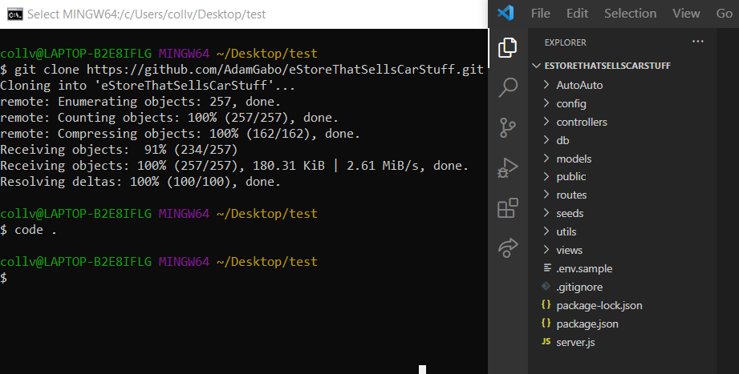
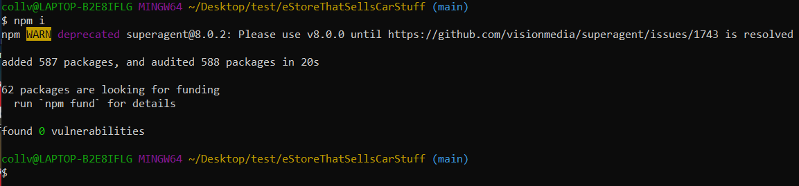
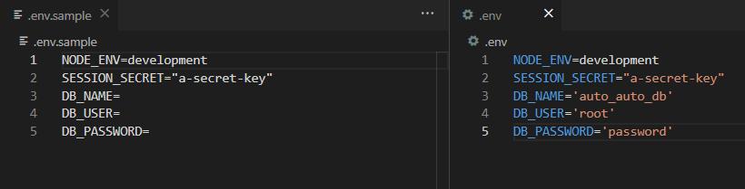
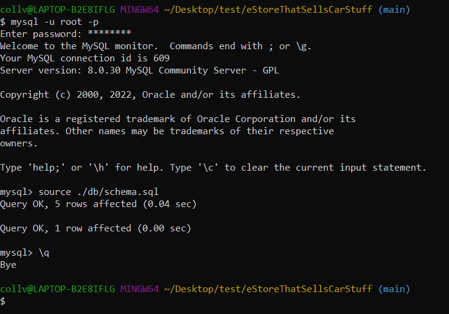

# AutoAuto

## Description

AutoAuto is the one stop website shop to setup an appointment to buy the car of your dreams today! The motivation behind making AutoAuto was to create a hub for a would-be car dealership so they can showcase their cars online. Users can login and view the various cars and car data. Autouto was made with using the MVC method where it uses sequilize to interact with a MySQL database.

## Table of Contents

- [URLs](#urls)
- [Installation](#installation)
- [Usage](#usage)
- [Credits](#credits)
- [License](#license)

## URLs
Github repositry link: https://github.com/AdamGabo/eStoreThatSellsCarStuff  
Deployed application link: https://stormy-wildwood-35895.herokuapp.com/

## Installation
To Install and begin working on the AutoAuto project follow these easy steps:

1. Open the terminal at the directory you would like to clone the project
2. In the terminal enter: '<b>git clone https://github.com/AdamGabo/eStoreThatSellsCarStuff.git</b>' to create a clone of the AutoAuto Repo
3. In the terminal enter: '<b>code .</b>' to open the project in the Visual Studios development environment

4. The project will still need to install the required node packages. In the terminal window change directory to the newly cloned AutoAuto project by entering: '<b>cd eStoreThatSellsCarStuff</b>' 
5. Now that you are in the correct directory, install the node packages with: '<b>npm i</b>'.

6. In the Visual Studios Explorer Window make a copy of the .env.sample file and paste it in the projects main folder.
7. Rename the copied file from '.env.sample' to '<b>.env</b>'.
8. In the .env file set the DB_NAME='auto_auto_db', fill in DB_USER='your MYSQL username here' and fill in DB_PASSWORD='your password here'

9. Now to create the database open the MySQL Command Shell using the command: '<b>mysql -u (your MYSQL username) -p</b>'
10. Enter the your MYSQL password: '<b>your MYSQL password here</b>'
11. Run the command '<b>source ./db/schema.sql</b>' to create the database
12. Now exit MySQL using '<b>\q</b>'

13. Enter the command '<b>npm run seed</b>' to populate the database with data

This initializes the project to d '<b>node ./seeds</b>'
This will see the wwebsite!As for seeding the deployed heroku website, in the terminal in the app dyno in heroku and enter the command:
'<b>heroku run bash</b>' followed by the command '<b>node ./seeds</b>'
This will see the wwebsite!

## Usage

To run the application open the projects main folder in the terminal
Enter the command '<b>npm start</b>'

## Credits

Collaborators:
- Erifeoluwa Femi-ladiran [Git Hub](https://github.com/FOR-TIMI)
- Adam Gaboury [Git Hub](https://github.com/AdamGabo)
- Cindy Xin Wang [Git Hub](https://github.com/CindyX1109)
- Antonio Rodrigo [Git Hub](https://github.com/Maemis)
- Asra Pervez [Git Hub](https://github.com/asrabilal)
- Justin Collver [Git Hub](https://github.com/threewide)

Guide's:
- Rich Widtmann [Professional README Guide](https://coding-boot-camp.github.io/full-stack/github/professional-readme-guide)
- Choose a License [MIT License Template](https://choosealicense.com/licenses/mit/)

## License

Copyright (c) [2022] [Justin Collver]

Permission is hereby granted, free of charge, to any person obtaining a copy
of this software and associated documentation files (the "Software"), to deal
in the Software without restriction, including without limitation the rights
to use, copy, modify, merge, publish, distribute, sublicense, and/or sell
copies of the Software, and to permit persons to whom the Software is
furnished to do so, subject to the following conditions:

The above copyright notice and this permission notice shall be included in all
copies or substantial portions of the Software.

THE SOFTWARE IS PROVIDED "AS IS", WITHOUT WARRANTY OF ANY KIND, EXPRESS OR
IMPLIED, INCLUDING BUT NOT LIMITED TO THE WARRANTIES OF MERCHANTABILITY,
FITNESS FOR A PARTICULAR PURPOSE AND NONINFRINGEMENT. IN NO EVENT SHALL THE
AUTHORS OR COPYRIGHT HOLDERS BE LIABLE FOR ANY CLAIM, DAMAGES OR OTHER
LIABILITY, WHETHER IN AN ACTION OF CONTRACT, TORT OR OTHERWISE, ARISING FROM,
OUT OF OR IN CONNECTION WITH THE SOFTWARE OR THE USE OR OTHER DEALINGS IN THE
SOFTWARE.
